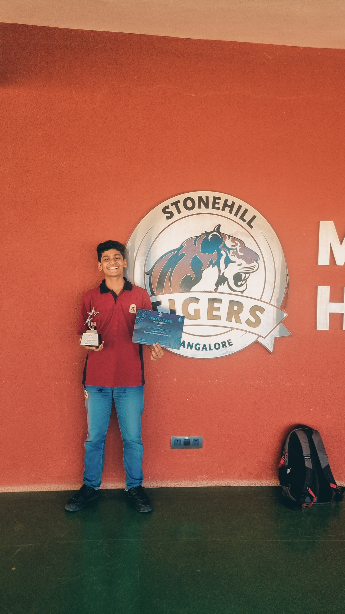

# AirGuard - TechnoFest 2026 Submission

**TechnoFest 2026 State Level Hackathon — 2nd Prize (Junior Category)**

  
   
  <strong>Lead Architect / System Builder</strong>

 

-%2394A3B8?style=for-the-badge)

AirGuard is a real-time geofencing and pre-flight risk assessment engine engineered in 24 hours for the TechnoFest 2026 State Level Hackathon (Stonehill International School). The system integrates spatial mapping, live environmental data, and an LLM-driven compliance assistant to optimize UAV deployment protocols.

**Winner: 2nd Prize | Category: Junior (Non-BAASC Schools) | State Level**

AirGuard is a drone pre-flight planning tool built in 24 hours for the **TechnoFest 2026 State Level Hackathon** hosted by Stonehill International School. Our goal was to create an easy-to-use interface for drone pilots that automatically checks for safety rules, weather conditions, and restricted airspaces.

## 🚀 Team Daemons
- Built with lots of ☕ and ❤️ for TechnoFest 2026.
- GitHub: [SaifanX/AirGuard-Daemons](https://github.com/SaifanX/AirGuard-Daemons)

## ✨ Features
- **Interactive Map:** Draw your flight path and see instant risk scores.
- **Smart AI Assistant:** Powered by Google Gemini to help you understand flight rules.
- **Real-time Weather:** Checks wind and visibility to see if it's safe to fly.
- **Mission Export:** Save your plans as GPX or KML files.
- **Live Simulation:** See a virtual flight of your drone before you take off.

## 🛠️ Tech Stack
- **Frontend:** React + Tailwind CSS
- **Backend:** Convex
- **Maps:** Leaflet & Turf.js
- **AI:** Google GenAI SDK (Gemini-3-Flash)
- **Icons:** Lucide-React
- **State Management:** Zustand

## 🏆 Awards
- **2nd Prize** at TechnoFest 2026 (Junior Category - Non-BAASC Schools) - February 2026.

  
-%2394A3B8?style=for-the-badge)

## 📝 Disclaimer
This project was made for a student competition. Always follow your local aviation authority's actual laws and use official apps for real drone flying!
